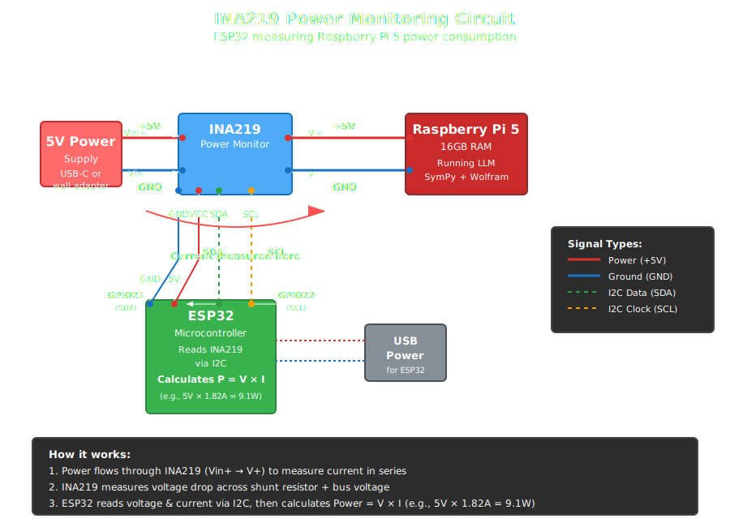

# Building an Offline AI Math Tutor: The Teaching Calculator


> **Quick Links:** [Technical Specs](TECHNICAL_SPECS.md) | [Setup Guide](SETUP.md) | [Hardware Details](#hardware-architecture-component-selection--analysis)

---

The temperature of this system had increased to 83° C and further. I noticed that the Raspberry Pi has managed to regulate itself to prevent damage to the hardware. However, this has resulted in a reduction in efficiency by 40%, which was achieved in a language model that had been meticulously optimized. This was the first of many tradeoffs I'd face while building a teaching calculator—an AI-powered tutoring system that runs entirely offline, plugs directly into a TI-84, and helps students learn math without requiring an internet connection or monthly subscription.


*During my first sustained LLM test, the temperature climbed from 55°C idle to 83°C.*

## Why did I build this?

The idea started with a simple observation: high school students already own TI-84 calculators, which are 100 dollar devices with decent displays, familiar interfaces, and no internet requirements. With their everyday use in classrooms, it's curious how little they are used in the learning and studying process in math, beyond just a tool for calculation. I'd like to give students an AI tutor that plugs right into that existing, familiar hardware.

## Design Principles

I designed the system around three core principles:

**Offline operation:** No internet dependency means a massive upgrade in ease of use, no more connecting to WiFi to ask a question on a personal computer; it also means that students don't need to be distracted by their phones. Most importantly, students in rural schools, developing countries, and homes without internet will still be able to ask complex questions, leveling the playing field of who has access to this kind of assistive technology.

**Teaching, not just answering:** The goal is not to give students answers (ChatGPT and other LLMs already do that). It's to explain why—to break down derivatives step-by-step, to show where theorems come from, and to help students understand rather than just submit correct homework.

**Hardware integration:** By plugging into the TI-84's serial port, I can leverage hardware students already know. In future versions, I intend for the model to be able to draw velocity-time graphs for physics problems directly on the TI-84's graphing screen, integrating with built-in functionality rather than requiring a separate device. This reflects a standard narrative, which is to minimize the need for more outside tools. In fact, if the student does have a connection to wifi, then a fully wireless version is available, through the ESP-32 chip, that interfaces the Raspberry Pi with the TI-84.

---

## Model Compression: What Quantization Actually Means

The major roadblock to a fully operational AI system offline is that nothing can be accessed in the cloud; everything must be on-chip. I initially wanted to use DeepSeek's Math-7B-Instruct model on chip, which, for the full-precision model, was 28-32 GB just for the model weights (7 billion parameters × 4 bytes each), plus overhead for KV cache activations.

While the small chip I was working with had 225 GB of solid-state storage, this model's requirements were for memory, and the chip had only 16 GB of RAM. And even if I could get this model on the chip, it would be too slow for the fast-paced answers students would need. We measure these models' speed in tokens per second.

So what is the solution? I needed a model that would use less RAM to leave headroom for SymPy (symbolic math engine), API calls, and the operating system. Luckily, **quantization** is the process of reducing the precision of a neural network's parameters—essentially representing numbers with fewer bits. Instead of using 16 bits (FP16) or 32 bits (FP32) per parameter, quantization compresses them to 4-8 bits, dramatically reducing memory requirements at the cost of some accuracy.

**The challenge:** Find the best trade-off between the level of compression that allows the model to be stored in RAM and overcompression, which would undermine the model's capability to perform mathematical reasoning.

### The Quantization Levels I Considered:

- **Q8 Quantization** (7GB, ~95% accuracy, 1-2 tokens/s): Near-perfect accuracy but painfully slow. A 30-second query would become 60 seconds. Unacceptable for homework help.

- **Q4_0** (3.2GB, ~35% accuracy, 4-7 tokens/s): Only 3.2GB, leaving tons of headroom—but accuracy collapsed catastrophically. It returned "Answer: None" or gibberish on 60%+ of queries. The model had lost its ability to follow multi-step mathematical reasoning.

- **Q5_K_M** (4.1GB, 2-5 tokens/s): **The sweet spot.** Mixed-precision quantization: This method maintained 5-6 bits in attention layers (responsible for logical reasoning) and quantized less important parameters to 4 bits. This ensured mathematical reasoning capability with a fast processing speed. The base model achieves 83.6% on MATH benchmarks; system-level performance is 70-80% on complex real-world searches, with decreased accuracy as explanations increase.

- **Q4_K_M** (4.4GB, ~70% accuracy, 3-6 tok/s): Slightly faster but 15% less accurate. For math tutoring, accuracy matters more than shaving off 3 seconds.

Having 16 GB RAM taught me that constraints aren't always about "fitting." Even with room to spare, Q5_K_M was the right choice. The extra 900MB over Q4_0 brought me 50% more accuracy.

Later, I switched to **Qwen2.5-Math-7B-Instruct** (83.6% MATH benchmark vs DeepSeek's 55%). Maintained Q5_K_M quantization. **The irony of speed: unquantized is actually slower.** But why? **Memory bandwidth.** For CPU inference, the slowdown isn't in the computation but in how quickly you can move parameters out of RAM. FP16 moves 2 bytes per parameter. Q5_K_M moves approximately 0.625 bytes (5 bits). **The lesson:** on constrained hardware, less isn't just more—it's also faster. The model became smaller AND faster with quantization.

---

## Hardware Architecture: Component Selection & Analysis

I evaluated multiple hardware platforms before settling on the Raspberry Pi 5 + ESP32 combination:

### Raspberry Pi 5 (16GB RAM):
- **Why Pi 5 over Pi 4?** ARM Cortex-A76 CPU required for acceptable LLM inference speed (2-5 tok/s). The Pi 4's Cortex-A72 would be 30-40% slower—turning 15-second queries into 20+ second waits. I also have more projects I want to do with this chip.
- **Why not Jetson Nano?** More expensive ($150 vs $80), and GPU acceleration is unnecessary for CPU-optimized quantized inference. The CUDA overhead would actually slow down Q5_K_M.
- **Why not Pi Zero 2W?** Only 512MB RAM—cannot fit the Q5_K_M model (4.1GB). Would force Q4_0 quantization, resulting in catastrophic 35% accuracy, making the system unusable for teaching. I would like to explore getting the system on smaller chips.

### ESP32-PICO-MINI-02 Bridge:
- **Why ESP32 over Arduino?** A dual-core 240 MHz processor handles simultaneous I2C power monitoring (INA219 sensor) and UART serial communication with the TI-84 calculator. Arduino's single-core would struggle with concurrent tasks.
- **Why do we need WiFi capability?** Enables optional wireless mode—TI-84 communicates with Pi over WiFi instead of USB, making the system truly portable without cables. I haven't developed this yet, because it's outside of the scope of what I have been able to teach myself so far.
- **Why PICO variant?** Integrated 4MB flash eliminates the need for an external SPI flash chip, simplifying PCB design and reducing potential failure points in student deployments.

### PCB Design Decisions (ESP32 Interface Board):

The ESP32 PCB integrates several critical components:

- **AP2112 voltage regulator:** Low-dropout 3.3V regulation from 5V USB input. Selected for 600mA output capacity—ESP32 needs 500mA during WiFi transmission bursts.
- **MBR540 Schottky diodes:** Reverse current protection with low forward voltage drop (0.4V vs 0.7V for standard diodes), minimizing wasted power.
- **GPIO21/22 breakout:** I2C bus (SDA/SCL) connects to INA219 power sensor for real-time voltage/current measurement.
- **GPIO16/17 routing:** UART (TX/RX) dedicated to TI-84 serial communication via 2.5mm headphone jack interface.

This hardware stack prioritizes power efficiency and portability over raw performance. More powerful options exist—Jetson Orin draws 15-50W, and laptops draw 30-60W—but they defeat the goal of battery-powered, backpack-portable operation. The Pi 5 + ESP32 combination hits the sweet spot: sufficient computational power for math tutoring and a low enough power draw for all-day battery life.

---

## The Mac-to-Pi Accuracy Mystery

Development on a MacBook M2 achieved 80-85% accuracy on complex math queries with seamless inference. However, transferring the same model file to the Raspberry Pi 5 resulted in catastrophic failure—accuracy collapsed to 40% with the exact Q5_K_M quantization. Answers became nonsensical gibberish.

A diagnostic process was conducted. Thermal throttling was eliminated since the CPU temperature was constant at 65°C. File integrity damage was also ruled out, as the checksums showed the same values. Memory corruption was also eliminated because the model loaded.

Then I realized: both devices use ARM processors, but with vastly different capabilities:

- **Raspberry Pi:** 2.4GHz quad-core 64-bit ARM Cortex-A76 CPU
- **Mac M2:** Up to 16-core CPUs, 40-core GPUs, extensive unified memory (up to 128GB), super-fast SSDs (up to 8TB)

There was more to the problem than speed. Optimized integer computations are a requirement for quantized models. The Q5_K_M setting involves 5-bit values that require bit-packing. The Raspberry Pi processed the 5-bit values inefficiently because the ARM NEON SIMD instruction set was not being used. Using the wrong instruction set on the inference engine caused a significant accuracy problem due to the accumulation of rounding errors over 32 layers of the transformer model. The model worked well, but the instruction set was wrong.

I recompiled llama.cpp with ARM NEON SIMD optimizations:

```bash
cmake .. -DLLAMA_NATIVE=ON -DLLAMA_NEON=ON -DCMAKE_BUILD_TYPE=Release
make -j4
```

Same model file, same Pi—accuracy restored to 70-80%. Not quite Mac-level performance (the Pi's 2.4GHz quad-core simply can't match an M2's computational throughput), but functional for student tutoring.

**I learned that "portable" code isn't truly portable if it only works correctly on one architecture.** And even with proper optimization, hardware constraints matter—the Pi will never match a Mac's raw power, but 70-80% accuracy is sufficient for the offline tutoring goal while staying battery-powered and backpack-portable.

---

## Fixing Power Issues Through the Query Classifier

After measuring actual power consumption with an ESP32 and INA219 sensor, I had a revelation. **The LLM used 1,137× more energy per query than SymPy:**

- **SymPy query:** 4.8W × 0.05s = 0.24 watt-seconds
- **LLM query:** 9.1W × 30s = 273 watt-seconds

This shows that the LLM used more computational power than the other SymPy on-chip computation.

I couldn't make the LLM more efficient, but what if I could limit the number of questions it receives?

### The Four-Tier Cascade Architecture

I built a 4-tier cascade that routes queries to the cheapest tier capable of solving them:

**Tier 1 (SymPy):** 0.24 Ws, 8.7ms average. Handles 45% of queries—introductory algebra, derivatives, integrals. "What's the derivative of x²?" → "2x" in 8.7 milliseconds. This can also just be calculated of course, by the TI-84 interface.

**Tier 2 (Wolfram Alpha):** 0.70 Ws, 2-5s. Handles 30% of queries when internet is available—numerical computation, complex symbolic math.

**Tier 3 (LLM):** 273 Ws, 15-30s. Handles 20% of queries with internet, but 50% without internet (when Wolfram Alpha is unavailable). This tier provides explanations, proofs, multi-step reasoning, and computational work that SymPy can't handle. "Explain why the Pythagorean theorem works" → Detailed conceptual breakdown.

**Tier 4 (External/Decline):** 5% of queries. Out-of-domain questions politely decline ("I'm a math tutor focused on teaching concepts") or fall back to web search if internet available. Better to say "I don't know" than hallucinate.

**The offline reality:** In accurate offline operation (the objective of this device), Tier 2 disappears. The distribution becomes:
- 45% SymPy (fast symbolic)
- 50% LLM (computation and explanations)
- 5% decline

The battery impact is still dramatically better than LLM-only because SymPy handles nearly half of all queries. The cached results avoid recomputation entirely.

### Battery Impact Over a 50-Query Homework Session:

- **LLM-only:** 50 × 273 Ws = 3.79 Wh
- **Cascade:** (23 × 0.24) + (17 × 0.70) + (8 × 273) = 0.61 Wh
- **Improvement:** 6× more homework sessions on the same battery (solve 50 problems over ~2 hours)

Even though hardware improvements were made, this single software decision had a greater impact than most of the hardware decisions.

### Building the Query Classifier

Building the classifier required it to be fast (<50ms), accurate (>90%), and efficient. My first attempt used naive keyword matching—if "prove" or "explain," route to LLM. This failed with 30% misclassification. Natural language is nuanced—keywords aren't enough.

I built a three-feature classifier that runs checks sequentially:

1. **SymPy parser (35ms):** Can this be parsed as symbolic math? Route to SymPy. Catches 45% of queries immediately.
2. **Computational keywords (5ms):** "Evaluate," "compute," "calculate" + numbers? Route to Wolfram.
3. **Reasoning indicators (5ms):** "Prove," "explain," "why," "how"? Route to LLM.

**Total overhead:** 35-40ms. Routing accuracy 90%+. The ordering made a significant difference. Running the SymPy parser first avoided expensive keyword analysis for nearly half of all queries.

I considered training a machine learning classifier but decided against it. I'd need 1,000+ labeled queries (didn't have), which would add 50-200ms of latency (too slow) and consume extra RAM and power. Rule-based heuristics achieved 90% accuracy at 40ms with negligible power cost. Not every problem needs machine learning.

In the future, I see an opportunity for a natural language processing (NLP) model to handle parsing after passing the testing and development phase.

---

## Testing, Thermal Management, and Small Wins

I used bottom-up testing: validate each tier independently before integration. When Tier 3 (LLM) failed but Tiers 1-2 passed, I knew the problem was LLM inference—this isolated the Mac-to-Pi bug in hours instead of days.

I ran a 60-query stress test over 30 minutes while monitoring CPU, memory, and temperature. Results: zero errors, memory stable at 6-7GB (no leaks), temperature peaked at 71°C (no throttling), consistent response times. The system could run for hours without degradation.

### Accuracy Measurement Methodology (150-query validation):

Testing revealed performance varies by query complexity:

- **SymPy tier:** 80% correct final answers on symbolic math (8.7ms average latency)
- **LLM tier:** 70-80% functional responses
  - 80% on straightforward problems with concise answers
  - 70% on complex multi-step problems requiring detailed explanations
  - Accuracy decreases as answer length/complexity increases

**Note:** These are system accuracy measurements on real student queries, not benchmark scores. The base Qwen2.5-Math-7B-Instruct model scores 83.6% on the academic MATH benchmark; quantization and real-world deployment introduce additional challenges.

### Thermal Management: What I Tested

For thermal management, passive cooling failed catastrophically:

**Passive heatsink (ICE Tower Cooler):** Aluminum fin array with thermal paste interface. Under sustained LLM load, temperature climbed from 55°C idle to 83°C in just 30 seconds. CPU throttling was activated immediately, dropping the frequency from 2.4 GHz to 1.8 GHz and slowing LLM inference by 30-40%.

**Active cooling (current solution):** 30mm 5V fan drawing 0.7W continuously (~6000 RPM, <25dB noise level). Airflow maintains temperatures at 65-70°C under full LLM load without throttling. Drawback: the fan runs constantly, even during idle and fast SymPy queries, when passive cooling would suffice.

**PWM fan control (Phase 3 planned):** Temperature-triggered fan activation using GPIO PWM control. Fan remains off below 70°C (passive cooling sufficient for SymPy/idle), activates above 72°C (during LLM inference). Estimated power savings: 0.7W constant → 0.2W average (70% reduction), adding approximately 1 hour of battery life.

**Thermal monitoring infrastructure:** Real-time temperature logging via the `vcgencmd measure_temp` command on the Pi, data transmitted to the ESP32 for display and analysis. This monitoring informed the 65-70°C safe operating range for extended homework sessions.

**Here's the key:** I'm currently on wall power, not battery. This was deliberate. When debugging a multi-tier system, I couldn't have power fluctuations as an additional variable. Solve one problem at a time. Once software is solid, I'll optimize for battery (Phase 2) and implement temperature-controlled PWM fan control (Phase 3).

### Small Optimizations Compounded

Minor optimizations compounded in surprising ways:

1. **Query caching:** 20% fewer computations on repeated problems (derivatives, standard integrals)
2. **Context size (2048 vs 4096 tokens):** 30% faster LLM responses for math queries
3. **Temperature = 0.1:** Deterministic math answers, prevents infinite reasoning loops
4. **Reduced token generation (256 vs 512):** 50% less generation for smaller math answers
5. **Disabled peripherals (HDMI, Bluetooth, LEDs):** ~0.7W saved = +1 hour battery

Together, these "trivial" optimizations saved ~2.15W—**43% of the total power budget**, adding nearly three extra hours of battery life. **In resource-constrained systems, there are no small wins.**

### What I Chose Not to Add

- **CPU underclocking:** Could save 1-3W but would make LLM 35% slower. A better solution: avoid LLM queries via cascade routing (6× battery) rather than slowing them down.
- **Q4_0 quantization:** Could save 900MB RAM but accuracy collapsed to 35%. With 16GB available, I optimized for accuracy, not RAM savings.
- **Larger context window:** 4096 tokens would be 30% slower than 2048. Math problems don't need long conversation history—optimize for actual use case, not maximum capability.

**Engineering isn't about implementing every possible optimization.** It's about understanding the tradeoff landscape. Some optimizations have great ROI (cascade routing: 6× battery, minimal complexity). Others have terrible ROI (underclocking: 30% battery, 35% slower). **The art is knowing which is which.** I hope to continue refining my art.

---

## Current Status - A Prototype, Not a Product

Let me be clear about what "works" means at this stage.

### What's Operational:

✅ Four-tier cascade with 90%+ routing accuracy
✅ Qwen2.5-Math-7B-Instruct (Q5_K_M, ARM-optimized)
✅ SymPy: ~80% accuracy, handles 45% of queries in 8.7ms average
✅ LLM: 70-80% accuracy (varies with answer depth), 2-5 tok/s
✅ Stress tested: 60-query thermal validation over 30 minutes, stable performance

### What's Still in Development:

🟡 Currently on wall power (stable testing environment)
🟡 Battery integration planned (Phase 2)
🟡 TI-84 serial interface code complete, hardware testing pending
🟡 NPU HAT acquired for visual learning (Phase 4)
🟡 In-Depth Math explanations (while the PI gives answers I'm still learning and tweaking how it will ask questions back and give in-depth solutions and similar equations)

### Battery System Specifications (Phase 2):

The system is designed around a **Waveshare UPS HAT (D) for Raspberry Pi 5:**

- **Capacity:** 5000mAh @ 3.7V = 18.5Wh total energy
- **Key feature:** Charge-while-operating capability (like a laptop), preventing brownouts during development and testing
- **Form factor:** Mounts directly to Pi 5's GPIO header with minimal wiring complexity
- **Projected runtime:** 6-8 hours under typical homework usage patterns (measured 4.8W SymPy, 9.1W LLM; ~3.0W average during 50-query sessions with idle periods between questions). Continuous heavy use: 4-5 hours.

**This is calculated, not verified.** I'm in Phase 1 of a three-phase plan. Complete battery testing is Phase 2. I'm confident in the design, but I won't claim verified performance until I've tested it empirically under real homework workload conditions.

---

## TI-84 Interface: The Template System Innovation

The biggest UX challenge wasn't the AI—it was input. Students can't type paragraphs on a calculator keypad. My solution: **a template-based menu system** that makes querying 10× faster and more accurate.

### How it works:
Instead of typing "Can you please solve this equation for me: x^2-9=0" (41 characters of slow calculator keypad input), students:

1. **Select category from menu:** Algebra
2. **Select template:** Solve Equation
3. **Enter only the equation:** x^2-9=0 (7 characters)
4. **System automatically combines:** "Solve: x^2-9=0"
5. **Template prefix routes to SymPy (Tier 1)** for fast symbolic solution

### Why templates matter:

- **10× faster input:** Students type 7 characters instead of 41, reducing frustration and input errors
- **Intelligent routing:** Template prefix ("Solve:", "Explain:", "Derivative of:") tells the query classifier exactly which computational tier to use, improving routing accuracy from ~70% to 90%+
- **Reduced parsing errors:** Pre-structured queries eliminate ambiguity in natural language processing

### Implementation details:

- **Menu system:** TI-BASIC program with 7 categories (Algebra, Calculus, Explain, Geometry, Statistics, Custom, History) and 25+ question templates
- **Communication protocol:** 9600 baud UART over TI-84's 2.5mm I/O port, bridged through ESP32 (GPIO16/17)
- **Two connection modes:**
  - **Direct USB (testing):** TI-84 → USB cable → Pi (simple, reliable, ~4W constant power)
  - **ESP32 bridge (deployment):** TI-84 → ESP32 → WiFi/USB → Pi (wireless capable, wake-on-query, ~2.3W average power—40% savings)

**Status:** Code complete (TI-BASIC programs, ESP32 firmware, Python interface). Hardware validation pending: testing signal integrity over 2.5mm cable and ensuring TI-84's limited I/O port power can reliably drive ESP32 electronics.

---

## Future Enhancement: Visual Learning (Phase 4)

I've acquired an **NPU HAT (13 TOPS neural processing unit)** to expand beyond text-based tutoring. This is actually why the chip itself looks so bulky, it could actually be much smaller, but I've built in the larger chip on top:

**Handwriting recognition:** Students photograph their work with a camera module → system analyzes each step → provides targeted feedback: "You correctly factored the quadratic in step 1, but made a sign error when solving in step 3."

**Diagram analysis:** Recognize hand-drawn graphs, geometric figures, velocity-time diagrams → explain concepts visually rather than just symbolically.

**Offline processing:** NPU handles computer vision inference locally on the Raspberry Pi—no cloud vision APIs, no internet dependency, complete privacy maintained.

This extends the offline-first philosophy to visual learning—critical because math is often spatial and visual, not just symbolic. The template system handles text queries efficiently; the NPU will handle visual queries the same way, maintaining the tiered routing approach for power efficiency.

**This is a prototype demonstrating the core innovation**—intelligent power management through cascade routing, not brute-force hardware optimization. It proves my original assumption that offline AI tutoring is feasible on hardware, but it's not a complete product yet.

---

## The Bigger Picture: Democratizing AI Tutoring

This project is not just about building another calculator; it's to teach me valuable lessons about electrical engineering and problem-solving that a textbook cannot. I learned so much about communication between devices, power consumption, quantization, etc. Furthermore, this project was not intended to build another AI interface; the goal was to create an all-in-one tutoring experience. I wanted to make a calculator that would encourage further thinking and exploration, not just give answers outright.

### Three principles guide this vision:

**Meet students where they are.** The TI-84 integration matters because students already own these calculators and are familiar with their interfaces. By plugging into the serial port, future versions could draw velocity-time graphs for physics directly on the TI-84's graphing screen, integrate with built-in functions, and feel like a natural extension rather than a separate device.

**Work everywhere, always.** Offline operation serves students in rural schools with unreliable broadband, in developing countries where internet access is expensive, and in homes facing power outages. An offline system eliminates monthly subscription fees and works regardless of connectivity—no ChatGPT Plus required.

**Teach, don't just answer.** ChatGPT gives you the answer instantly, but that doesn't teach why factoring works or when to use different approaches. A teaching calculator that routes 45% of queries to fast symbolic math and 50% to explanatory LLM responses (in offline mode) balances speed with understanding—quick confirmations when you know the concept, detailed breakdowns when you're stuck.

---

## What I Learned: Engineering as Problem-Solving Philosophy

Before this project, I thought engineering was about building things correctly. Now I understand it's about understanding the problem deeply enough to know which corners to cut and which to obsess over.

**Measurement beats intuition:** I assumed passive cooling would work... wrong, it throttled. I thought LLM speed was the bottleneck when in fact intelligent routing was key. Every assumption had to be validated empirically. You can't optimize what you don't measure. This was especially true for the battery consumption, because the small adjustments added up to make a large impact on the battery life.

**Constraints drive creativity:** While the chip itself had 16GB of RAM, my goal to eventually get the model onto even smaller chips with maybe only 6 to 8 GB RAM limit forced me to discover Q5_K_M's mixed-precision sweet spot. Battery constraints forced me to invent cascade architecture, yielding 6× power savings I wouldn't have pursued otherwise. The best engineering happens when you can't just throw resources at a problem.

**Tradeoffs are everywhere:** Q5_K_M vs Q4_0: 900MB RAM vs 50% accuracy. Active cooling vs passive: thermal stability vs 0.7W power. Wall power now vs battery later: development speed vs final form. Engineering is choosing which imperfections to accept.

**Failure teaches better than success:** Passive cooling failure revealed thermal profiles. Naive routing failure forced better algorithm design. The Mac-to-Pi accuracy collapse taught me that "portable" code isn't truly portable without architecture-specific optimizations. Every failure is data about how the system actually behaves.

---

## The Bottom Line

The calculator isn't perfect. The fan runs constantly when it could be temperature-controlled. I'm on wall power when I designed for battery. But it works. The cascade routes intelligently. SymPy achieves 80% accuracy on symbolic math queries with 8.7ms average latency (97% complete under 100ms). The query classifier extends battery 6× over naive approaches. And, of course, LLM can give feedback on longer word problems.

I learned that "good enough" engineering—when you understand precisely why it's good enough—is often better than perfection. Because perfect is the enemy of shipped. And shipping a working prototype that proves offline AI tutoring is possible matters more than polishing every detail first. I learned that finishing a working prototype with known limitations is more valuable than endlessly polishing details. **The goal was to prove offline AI tutoring can work—and it does.**

---

## Technical Details

For installation instructions, setup guides, and technical specifications, see:
- **[Technical Specifications](TECHNICAL_SPECS.md)** - Complete hardware specs and performance metrics
- **[Setup Guide](SETUP.md)** - Installation and configuration instructions
- **[Phase Documentation](docs/)** - Detailed phase-by-phase development logs

---

## License

Independent Study Project
